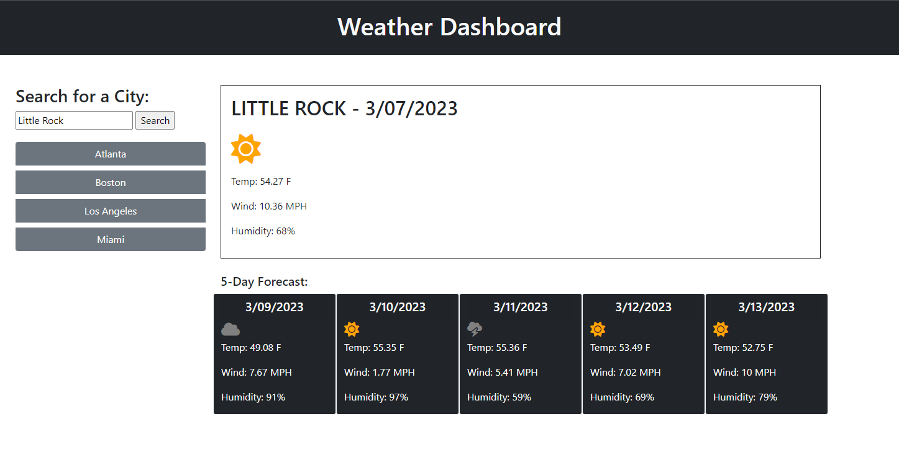

# Weather Dashboard

## Description

This simple, browser-based Weather Dashboard allows the user to quickly view up-to-date current and 5-day forecast weather information for a given US city.

This project challenged me greatly to use and expand my proficiencies with API calls and the fetch JavaScript method, parsing and formatting JSON objects into useable data, event listeners, methods, DOM traversal syntax, Day.js date formatting, and browser localStorage functionality.

## Installation

To load and utilize this Weather Dashboard, simply visit the following URL from any contemporary web browser connected to the internet, and follow the prompts:

https://peejd.github.io/Weather_Dashboard/

## Usage

Upon visiting the landing page at the above URL, the user is presented with a single-page Weather Dashboard.

The user can then either enter a major US city into the text input field (city name only) and hit the "Search" button to return weather information for that city, or click on one of the buttons below the search box with preset cities to return weather data for those.

I ran out of time before I could get the LocalStorage working to populate these buttons with previously searched cities, but plan to submit as is for now and continue finishing that finalizing that functionality this week and re-submit the assignment.

## Appearance

## Credits

To learn and implement the javascript and Day.js functionality in this webpage, I referenced the following websites and tutorials:

Bootstrap Framework Documentation:
https://getbootstrap.com/docs/4.0/

Open Weather API Documentation:
https://openweathermap.org/forecast5

MDN JavaScript Reference page:
https://developer.mozilla.org/en-US/docs/Web/JavaScript

W3 Schools Javascript and HTML DOM Reference:
https://www.w3schools.com/jsref/default.asp

Javascript.info LocalStorage reference:
https://javascript.info/localstorage

Day.js Documentation:
https://day.js.org/en/

## License

MIT License

Copyright (c) 2023 Peej D

Permission is hereby granted, free of charge, to any person obtaining a copy
of this software and associated documentation files (the "Software"), to deal
in the Software without restriction, including without limitation the rights
to use, copy, modify, merge, publish, distribute, sublicense, and/or sell
copies of the Software, and to permit persons to whom the Software is
furnished to do so, subject to the following conditions:

The above copyright notice and this permission notice shall be included in all
copies or substantial portions of the Software.

THE SOFTWARE IS PROVIDED "AS IS", WITHOUT WARRANTY OF ANY KIND, EXPRESS OR
IMPLIED, INCLUDING BUT NOT LIMITED TO THE WARRANTIES OF MERCHANTABILITY,
FITNESS FOR A PARTICULAR PURPOSE AND NONINFRINGEMENT. IN NO EVENT SHALL THE
AUTHORS OR COPYRIGHT HOLDERS BE LIABLE FOR ANY CLAIM, DAMAGES OR OTHER
LIABILITY, WHETHER IN AN ACTION OF CONTRACT, TORT OR OTHERWISE, ARISING FROM,
OUT OF OR IN CONNECTION WITH THE SOFTWARE OR THE USE OR OTHER DEALINGS IN THE
SOFTWARE.
